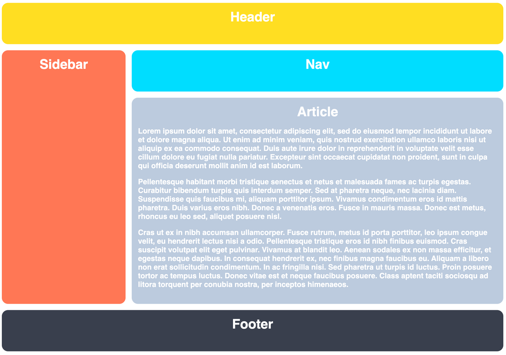

# El Layout del Santo Grial con Grid

Ahora es el momento de practicar las herramientas de Grid que hemos aprendido y crear un layout que puede parecer familiar. Vamos a hacer un layout conocido. La diferencia aquí es que no vamos a depender de Flexbox para este ejercicio. Solo usaremos Grid. ¡Podrás ver los beneficios de Grid por ti mismo!

### Pistas

- Solo necesitas agregar a los selectores CSS
- Vuelve a la lección Creando una Grid si olvidas cómo convertir un elemento en una grid
- Usa tamaños fijos (por ejemplo, píxeles) para tus columnas y filas

## Resultado Deseado

### Autoevaluación

- El espacio entre las columnas es de 15px
- Grid tiene dos columnas
- Grid tiene cuatro filas
- La segunda columna es tres veces más grande que la primera
- La tercera fila es cinco veces más grande que las otras
- Los elementos header y footer abarcan las dos columnas
- El elemento sidebar solo abarca la primera columna
- Los elementos nav y article abarcan la segunda columna
